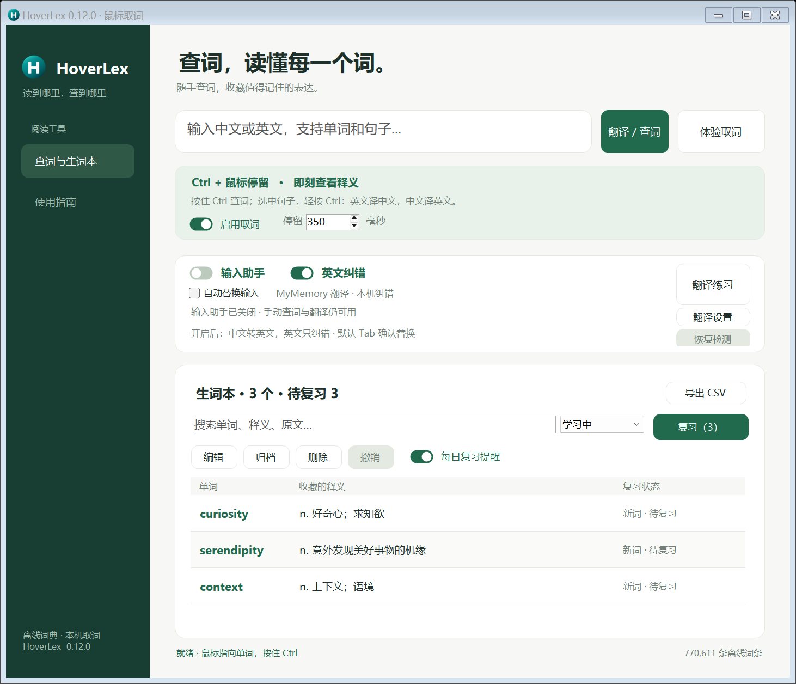

# HoverLex · Windows 鼠标取词

HoverLex 是 Windows 10/11 x64 英语阅读与输入助手：Ctrl 悬停查词、选中文字翻译、英文纠错、朗读，以及带复习计划的生词本。

当前版本 **0.12.0**，项目代码使用 **MIT** 许可。第三方词库、LanguageTool 和 Java 组件沿用各自许可，见 [第三方说明](THIRD-PARTY-NOTICES.md)。



本仓库提供源码、图标和构建脚本。词库及约 105 MiB 的纠错组件通过脚本准备，不纳入 Git；构建产物、个人生词、设置、API 密钥和发布签名私钥均不上传。构建步骤见[从源码构建](#从源码构建)，当前验证范围见 [VALIDATION.md](VALIDATION.md)。

## v0.12.0：输入检测恢复与状态提示

- 总开关改名为「输入助手」，明确同时控制中文输入翻译和英文输入检查；自动英文检查还需要开启「英文纠错」。保留原来的设置与快捷键。
- 英文检查超过约 800 毫秒时显示小提示；检查完成且未发现明显错误时短暂显示完成提示。有修改建议时显示可替换卡片，失败时保留输入并提供重试。
- 输入读取失效后自动恢复；连续故障时逐步延长重试间隔，最多等待 30 秒。重新输入、点击其他输入框或主窗口的「恢复检测」可提前重试。
- 翻译与纠错整次处理最多等待 40 秒。DeepSeek 临时连接故障、限流及部分服务端故障最多自动重试一次；无效密钥、配置和余额错误直接提示。
- 原文、焦点或输入位置变化后，旧结果和旧重试失效；连续点击替换只执行一次。关闭卡片取消待处理任务，后来的结果不能重新弹出。
- 状态提示与浮窗不抢输入焦点；替换前仍核对原文，保留未发送状态。生词、密钥与原有开关不因升级改变。

## v0.11.8：英文纠错漏显示修复

- 输入框短暂读取失败、重绘或输入法状态短暂变化后，尚未完成的英文检查会恢复；完成的检查不会重复提交。
- 读取进程超时重启时保留当前输入的检查触发，不必重新输入整句话。
- 英文纠错超时、服务故障或返回无效结果时显示提示卡，可点击「重试」。继续输入或切换输入框后，旧结果及旧错误提示都会失效。
- DeepSeek 显式使用 Windows 系统代理，并取消请求正文前的额外等待，改善代理环境下的连接兼容性。
- 正确英文和检查过程仍保持安静；有明确纠正结果时才显示可替换的英文。

## v0.11.7：WhatsApp 聊天消息选区修复

- 聊天消息没有普通文字选区接口时，先拖选或双击英文，再轻按并松开 Ctrl；程序只复制现有选区，并恢复原剪贴板，不粘贴或发送消息。
- 识别属于同一个 WhatsApp 的 WebView 复制来源，排除其他应用、密码框及已经变化的选区。
- WhatsApp 已拖选文字时，按住 Ctrl 不再被失败的悬停查询打断；松键后翻译选区。未选中文字的聊天区域仍不支持无截图悬停取词，失败卡片会提示操作方式。
- 一个文字节点失效或不支持选区时，继续检查同一窗口里的其他文字节点。

## v0.11.6：WhatsApp 英文误弹卡与 Ctrl 取词

- WhatsApp 输入读取以编辑框的实际 Value 为准，不再展开到周围段落；纯英文只做英文纠错。检查过程不弹卡，正确英文保留原文；中文纠错结果不会作为英文结果显示或替换。
- 没有选区时，鼠标停在英文上轻按并松开 Ctrl 也能取词；有选区时继续翻译选中文字。按住 Ctrl 停留的方式仍可使用。
- WhatsApp 达到停留时间后松开 Ctrl，不再丢弃仍在读取的结果；移动鼠标、切换窗口、输入其他键、暂停或按 Esc 仍会使旧结果失效。
- 一个文字节点读取失败后继续尝试同一 WhatsApp 窗口里的其他节点；输入读取超时后，在同一窗口重新点击或输入也可恢复。
- WhatsApp 使用编辑框的写入接口替换经过核对的整框内容，不依赖失效的网页选区；不会发送按键或消息。
- 纠错结果展示前先处理已排队的新输入，防止即时结果替换正在续写的原文。
## v0.11.4：WhatsApp 兼容修复

- 支持新版 WhatsApp 的独立 WebView2 文字窗口：Ctrl 悬停取词、选中文字后轻按 Ctrl 翻译，以及聊天输入框的中文转英文和英文纠错。
- 核对网页窗口与 WhatsApp 的进程归属，统一外层窗口和内层输入框的焦点；不截图，不读取其他应用的网页窗口。
- 输入框通过文字范围核对原文与光标，继续沿用翻译设置。替换只插入文字，不触发发送。
- 输入读取超时后可在切换输入框时自动恢复，不再永久停止监听。
## v0.11.3：修复启用后不触发取词

- 按住 Ctrl 并停留达到设定时间时，优先查询鼠标下的单词，已有选区不再挡住查词；松键后保留词义卡片，不追加整句翻译。
- 选中文字后轻按并松开 Ctrl，继续进行选区翻译。
- 词义卡片出现时保留阅读窗口与输入框焦点，支持连续查词；关闭再开启「启用取词」后可在原位置重新查询。

鼠标指向英文单词，按住 **Ctrl** 并停留约 **350 毫秒**，即可查看英汉释义、音标和附近原文。也支持先按住 Ctrl，再移动到单词上。

v0.10.4 已移除截图识字开关、图片识字引擎、自动识字回退和 Ctrl+Alt+O。

## v0.11.2：WPS、命令行与微信兼容

- 修复划词读取失败后仍阻挡鼠标取词的问题。按住 Ctrl 悬停时，失败的选区读取不再一直压住单词查询。
- 普通文本框增加原生字符位置读取；WPS 文字和 Word 增加文档坐标接口，核对真实文字边框，不移动光标或改写正文。
- Windows Terminal 与传统控制台会在同一窗口内寻找真正的文字控件；不支持单词范围的控件改用附近文字或行范围，再核对逐词坐标。
- 微信保持无截图：鼠标拖选英文或在输入框双击选词，然后轻按并松开 Ctrl。临时复制读取选区并恢复剪贴板，不粘贴或发送消息。无法读取悬停位置时，卡片会提示这个操作方式。
- 微信输入框支持 Ctrl+A 或 Shift+方向键选区后，再单独轻按 Ctrl；Ctrl+C 保留选区记录，输入、粘贴或移动光标后需要重新选择。选区读取失败会显示提示。
- 读取失败在鼠标旁显示具体原因；图片、扫描件和无法提供文字接口的区域仍不支持悬停取词。

## v0.11.1：鼠标取词沿用翻译设置

- 鼠标取词、手动单词查词和从生词本打开的释义都沿用同一服务、模型和密钥。免费模式查本机词典；DeepSeek 模式按附近原文解释单词，并先显示本地参考。
- DeepSeek 每次取词只发送单词与最多 800 字符的附近原文，不翻译整篇内容；没有语境时提供常见词义。同词同语境在当前设置下复用最近 64 条缓存，切换设置时清空。
- 联网查询不阻塞再次取词。移动鼠标离开取词位置、关闭卡片、暂停取词、按 Esc 或切换设置会取消旧请求。进入卡片阅读及松开 Ctrl 可继续等待结果。
- 可收藏 DeepSeek 给出的词义，同时保留原单词、离线音标和原文；接口失败会明确提示，本地参考仍可查看，不会改用其他在线服务。

## v0.11.0：翻译提速与生词复习

- 修复「启用取词」及其他开关末尾文字裁切，按实际 DPI 和文字宽度排版。
- 英文纠错复用本机 LanguageTool 进程；首次加载后，不再为每句话重新启动 Java。空闲三分钟后释放，退出时关闭。输入停顿等待由 700 毫秒缩短到 450 毫秒，继续输入和改变焦点仍取消旧结果。
- 免费翻译保留段落，并用临时占位符保护代码、链接和标识符；缺失占位符的译文不用于替换。长英文优先按单词或句子边界分段。
- 「翻译设置」可选择免费模式或 DeepSeek。免费模式为 MyMemory 翻译 + 本机纠错；DeepSeek 同时处理翻译与纠错，可选 `deepseek-flash` / `deepseek-v4-pro`，关闭思考模式。接口失败时提示保留原文，由你决定重试或切换，不会自动改用另一家服务。
- DeepSeek 密钥在 [DeepSeek 控制台](https://platform.deepseek.com/api_keys) 创建，直接填入软件中的密码输入框。选择 DeepSeek 后，待处理文字会发送至其官方 API 并按用量收费；「测试」按钮也会产生少量用量。密钥由 Windows 当前用户加密保存在 `UserData/deepseek-key.dat`，不写进设置 JSON 或发布包。
- 生词本支持搜索单词、释义和原文；筛选学习中 / 待复习 / 已归档；编辑释义和笔记、批量归档与恢复、确认后删除及撤销上次修改。
- 到期生词可用复习卡片自测，先回想再显示答案。「记得」使用 1、3、7、14、30、60 天间隔；「很熟」前进两级；「忘记」十分钟后再练。每轮最多 20 个，到期词不会因这个上限丢失。
- 软件在托盘运行时，每天最多提醒一次；提醒开关可关闭，点击通知开始复习。关闭软件时不会提醒，也没有新增开机启动或系统定时任务。
- 原有生词可直接读取；第一次编辑或复习时保存新字段并保留 `.bak`。CSV 增加归档状态、复习次数和下次复习时间。

DeepSeek 接入依据：[官方对话接口](https://api-docs.deepseek.com/api/create-chat-completion/)、[JSON 输出](https://api-docs.deepseek.com/guides/json_mode/)。功能实现与短句测试不代表所有文本的质量均已达到某个评分。

这是参考 [XiaolaiDict](https://github.com/xiaolai/XiaolaiDict) 取词思路独立实现的 Windows 项目。通过 Windows 界面文字接口读取鼠标处的英文单词，源码未复制原项目。

## 桌面安装版（推荐）

1. 按下面的源码构建步骤生成 `HoverLex-Setup-v0.12.0.exe`，再运行安装器。安装不需要管理员权限。
2. 安装器会将软件放到 `%LOCALAPPDATA%\HoverLex`，并在桌面创建 **HoverLex 鼠标取词** 图标。
3. 以后双击桌面图标打开：先检查最新发布版，有更新时自动下载安装并切换，再打开软件。
4. 点击“体验取词”，按住 Ctrl 后移动到示例英文单词上停留。

首次使用桌面版前，如旧免安装版还在托盘运行，请先从其托盘菜单退出。运行中重复打开桌面图标会唤起已有窗口；已经下载的新版在退出后下次启动时生效。

安装器会保留已安装的生词；能够找到本机项目旧免安装版的生词时，会迁移到新位置，不覆盖已有生词。

v0.3.0 使用暖白背景、森林绿侧栏与绿色按钮，调整字体、留白及生词列表的阅读层次。圆形 H 图标重新制作了高清透明图片，并提供 16 至 256 像素的九种图标尺寸，避免放大旧图造成锯齿。已安装版可通过现有本机更新渠道获取新界面；如需刷新桌面快捷方式的图标，再运行一次新版安装器即可。它只更新本软件快捷方式的图标，保留目标路径和已有生词。

### PowerShell 静默安装

当前为自制安装器，现已支持 `/VERYSILENT /SUPPRESSMSGBOXES /NORESTART` 和 `/S`。安装会创建桌面及开始菜单快捷方式，不打开窗口、不重启系统；成功返回 0，安装失败返回 1，参数无效返回 2。

推荐运行完整安装脚本，它会先备份生词，再静默安装，检查主程序与启动器版本、快捷方式和生词文件哈希，最后调用 `ie4uinit.exe -show`：

```powershell
powershell -NoProfile -ExecutionPolicy Bypass -File .\scripts\install-silent.ps1
```

仅检查现状使用 `-AuditOnly`，不会安装或刷新图标。结果及数据备份保存在项目的 `artifacts/install-audit-*` 中。只有图标仍旧且已决定重启资源管理器时，才额外加 `-RestartExplorer`；默认不会关闭资源管理器窗口。自动化安装采用 PowerShell，不模拟双击。

桌面与开始菜单快捷方式指向固定的 `HoverLexLauncher.exe`，由它检查更新并打开当前版本；图标来源为当前版本的 `HoverLex.exe`。直接指向版本目录里的主程序会跳过自动检查更新。

## 自动更新

默认更新来源是构建电脑上的项目发布目录：

```text
<项目目录>\updates\latest.json
```

后续开发并发布新版本后，桌面软件会在下次打开时自动获取；不需要重新下载或重新安装。没有新版时直接打开当前版。检查失败、更新包损坏或安装失败时继续使用原版本。

新版独立安装到 `versions`，生词和设置固定存放在安装目录下的 `UserData`，切换版本不会重建生词本。旧版本和上一版指针会保留。

源码公开在 [Matthew120790/HoverLex](https://github.com/Matthew120790/HoverLex)，默认自动更新仍使用本机构建目录。更新器支持 HTTPS 签名清单，需另行配置线上清单和程序包地址；公开源码不会自动改变已安装程序的更新来源。请保留本机项目的 `updates` 与 `.release-signing` 目录；后者存放用于发布更新的密钥，不应随源码公开或分发。首次从新克隆构建时会生成自己的发布签名密钥。

## 免安装版

1. 将免安装 ZIP **完整解压**到有写入权限的文件夹，比如桌面上的 `HoverLex`。
2. 双击 `HoverLex.exe`，等待底部显示“就绪”。请保留旁边的 `Dictionary` 文件夹。
3. 点击“体验取词”，按住 Ctrl 后移动到示例中的英文单词上。
4. 在卡片里点“发音”，或先选择符合原文的词义，再点“收藏词义”。

主窗口支持输入中文或英文，按 Enter 或点击「翻译 / 查词」：中文翻译成英文，英文句子翻译成中文；词典内的英文单词沿用翻译设置显示释义。关闭主窗口后，软件留在右下角托盘；从托盘菜单选择“退出”即可彻底关闭。

## 功能

- 英文单词取词：读取 Windows 界面文字；无法读取时提示原因。
- 内置 **770,611** 条 ECDICT 词条，查词不联网。
- 常见词形还原，例如 `mice → mouse`、`ran → run`、`studying → study`。
- 音标、中文释义、附近原文和 Windows 本地英语发音。
- 选择并保存词义与原文；生词本支持 UTF-8 CSV 导出。
- 托盘开关、停留时间设置和快捷键。
- 桌面安装器、固定启动器和每次启动自动检查更新。
- 取词进程设有超时，目标应用卡住时不会阻塞主窗口。
- 松开 Ctrl、移动鼠标或暂停后，过期取词结果会被丢弃。
- 鼠标取词、手动查词及从生词本打开的释义面板均置顶；每次显示重新确认置顶顺序，保留阅读窗口的键盘焦点。

查词仍由使用者选择符合语境的词义，**未实现原项目的 AI 自动判断词义**。

## 选中句子中英互译（v0.10.4）

用鼠标选中句子，再轻按并松开 Ctrl：英文翻译成中文，中文翻译成英文；中英混合句子翻译成英文。支持左 / 右 Ctrl，不必一直按住等待翻译。未选中文字时，仍可按住 Ctrl 悬停查单词；Ctrl+C 等组合键不会触发划词翻译。

划词翻译随取词的暂停开关启停，不需要开启「输入助手」。支持普通文本框、只读文本、Word 及提供文本选择接口的网页和文档；密码框不读取。每次最多选中 2000 字，不支持图片文字。翻译使用「翻译设置」中选择的服务，沿用「英文纠错」开关。

浮窗可复制译文、朗读英文原文或英文译文和重译，不替换原文，也不接管 Tab。改变选区、切换窗口、继续输入、按 Esc 或暂停时会取消旧结果。

v0.10.1 修正网页和终端的窗口识别，补充浏览器正文窗口及子节点读取；终端只检查选区坐标，不扫描整份历史输出。v0.10.2 增加微信主聊天窗口的选句兼容。直接读取失败时，在鼠标拖选过的 Chrome、Edge、Firefox 或微信主窗口中复制当前选区，并恢复原剪贴板内容；不改变聊天输入、不发送消息，密码框和微信登录弹窗不读取。拖选后可以稍等再按 Ctrl；继续输入、点击其他位置或滚动会取消这次拖选记录。终端保留原有命令执行和 Ctrl+C 行为。仍不能读取或禁止复制的应用会无法取得选区。

## 中英互译与 Tab 替换（v0.7.0）

主窗口输入框自动判断翻译方向，支持中文和英文句子，不需要开启「输入助手」总开关。含中文的混合内容按中译英处理；查到的英文单词沿用取词释义方式，其他内容通过在线服务翻译。

译文浮窗就绪后，保持原输入框的焦点，按 **Tab** 即可替换，也可点击「替换」。替换前仍会核对原文；继续输入、切换输入框或关闭浮窗后，旧译文不能覆盖新内容。译文等待中、功能关闭或没有可替换结果时，Tab 保留原来的作用；Shift/Ctrl/Alt + Tab 不触发替换。替换不会发送消息或执行命令。

英译中的浮窗点击「朗读」会读英文原文；中译英时读英文译文。主窗口输入框不再同时触发全局中文输入翻译，避免出现两张卡片。

## 中文输入翻译与发音

### 英文自动纠错（v0.8.0）

v0.9.0 在主窗口「输入助手」旁新增独立的「英文纠错」开关。开启时沿用下面的纠错流程；关闭时，纯英文不再自动检查，中文或中英混合内容直接翻译，主窗口的双向翻译也跳过纠错。切换立即取消旧结果，并记住选择，重启后保持你的设置。升级默认延续原来已开启的纠错行为。输入框内的自动检测仍需开启「输入助手」总开关。

开启「输入助手」后，输入纯英文也会检查常见拼写、语法和词语重复。例如 `recieve → receive`、`I has an apple. → I have an apple.`。浮窗显示纠正后的英文，支持复制、朗读和 Tab 替换；已勾选自动替换时，沿用原来的输入内容与焦点核对。没有发现错误则保留原文，不弹出替换结果。

中文夹英文时，先纠正英文部分，再翻译成英文，最后再检查英文译文。主窗口的中英互译也使用纠错后的内容；单词取词不自动改写原单词，DeepSeek 会结合语境选择词义。

免费模式使用随安装包提供的 LanguageTool 英文规则和 Java 运行时，在本机纠错，不需要 API 密钥，也不会上传纯英文纠错内容。纠错会跳过反引号内的代码、网址、邮箱、Windows 路径和常见标识符；翻译通过 MyMemory 在线完成。首次纠错需要解压本机组件，之后复用进程和运行时缓存。引擎覆盖常见错误，不能保证识别所有复杂语法、语义或推断含糊单词的原意；没有可用建议时保留原文。引擎故障或超时会显示提示并保留原输入。选择 DeepSeek 时，纠错与翻译改由其官方在线接口处理。

引擎来源：[LanguageTool](https://dev.languagetool.org/http-server.html)；组件许可与来源记录随程序提供，见 `THIRD-PARTY-NOTICES.md`。

v0.8.0 新增独立的纠错组件文件。从 v0.7.0 或更早版本升级时，请运行一次 v0.8.0 安装器以更新固定启动器；以后仍可沿用自动更新。

主窗口开启「输入助手」，或按 **Ctrl + Alt + T**。该功能与英文取词开关独立，托盘菜单也可开启或关闭；软件会记住选择。首次安装默认关闭，升级保留已有开关。

在支持的输入框中输入中文，停顿约 450 毫秒后，通过所选在线接口翻译成英文。浮窗置顶且保留输入焦点，提供「复制」「替换」「重译」「关闭」。继续输入、切换输入框、按 Esc 或关闭功能会取消旧结果。

不勾选「自动替换输入」时，浮窗显示英文，由你点击复制或替换。勾选后，译文完成并再次核对原文、焦点和输入位置，直接把当前中文换成英文。这个选项默认不勾选，也会记住选择。继续输入、移动光标、切换输入框或关闭功能会取消旧结果；无法核对时保留原文并提示手动复制。不会自动发送消息或按下 Enter。

英文译文出现后，点击浮窗「朗读」播放整句英语，按钮变为「停止」，可再次点击停止。手动或自动替换完成后，译文卡片保留，方便朗读和复制；继续输入、切换输入框、关闭卡片或关闭功能会停止播放。不会自动发声，也不会重复替换已完成的译文。

朗读使用 Windows 本机英语语音，无需再发送文字到在线服务。没有安装英语语音时，会提示到 Windows 语音设置安装。语音异步播放，不卡住输入。[语音接口说明](https://learn.microsoft.com/en-us/dotnet/api/system.speech.synthesis.speechsynthesizer.speakasync?view=netframework-4.7.2)

可点「翻译练习」测试。标准 Edit/RichEdit 输入框使用原生读取；Word 使用文档接口读取当前段落并保留段落末尾及其他段落，原生输入框和 Word 的替换支持撤销。Windows Terminal/普通控制台读取提示符后的当前输入；替换用退格和文字输入，不选中终端输出，也不发送 Ctrl+C。支持常见 PowerShell、cmd、Codex 的提示符；不认识的提示符、光标位于输入中间、复杂多行或特殊组合字符会提示暂不支持。

微信 4.x 隐藏文字接口时，登录后的主聊天窗口使用兼容读取：停顿后短暂选中并复制光标前的输入，恢复剪贴板和编辑位置，替换时保留光标后的内容。在这个很短的选中过程中新到达的键盘/鼠标动作会暂缓到收回选择后再交给应用，避免继续打字覆盖选中的原文。登录窗口、图片与弹出窗口不走兼容路径。缺少精确光标接口时，鼠标位置改变会让自动替换退回手动确认。

其他编辑器依赖其文字接口。已标记的密码框和只读区域跳过；单次当前输入/段落上限 2000 字。输入法候选框显示时暂停读取与替换，长内容按 UTF-8 大小分段请求。公共服务存在额度和网络限制，失败时保留原输入并显示提示。

免费模式需要中英互译时，当前编辑的输入文字发送至 MyMemory；纯英文纠错在本机处理。DeepSeek 模式将待翻译或纠错的文字发送至 DeepSeek。不会上传整份文档、聊天记录或终端历史，也不保存输入文本、译文或按键记录。兼容读取时临时缓冲的输入动作在恢复选择后释放；运行时翻译与纠错缓存在关闭功能时清空。免费翻译服务侧处理以 [MyMemory 服务条款](https://mymemory.translated.net/doc/en/tos.php) 为准；DeepSeek 以其平台条款为准。翻译引擎与离线英文词典独立，不影响生词本。详细技术验证记录在源码包的 `SPIKES-INPUT-TRANSLATION.md` 中。

## 快捷键

| 操作 | 效果 |
| --- | --- |
| Ctrl + 鼠标指向单词并停留 | 查鼠标下的英文单词 |
| 鼠标选中句子，再轻按 Ctrl | 英文译中文，中文译英文；可复制译文、朗读英文原文或译文 |
| Ctrl + Alt + T | 开启 / 关闭中文输入翻译 |
| Ctrl + Alt + H | 暂停 / 恢复 |
| Ctrl + Alt + D | 打开主窗口 |
| Ctrl + Alt + Q | 退出 |
| Tab（译文就绪且原输入框仍有焦点） | 用当前译文替换原文 |
| Esc | 收起取词与翻译浮窗，并取消当前请求 |

鼠标已经停在单词上时，按住 Ctrl 也能触发，无需再移动。识别暂时失败会在同一位置有限重试，最多尝试三次；松开 Ctrl、明显移动鼠标或暂停会取消旧结果。按 Ctrl+C、Ctrl+S 等组合键时会取消该次取词。快捷键被其他软件占用时，可以使用托盘菜单。


## 系统要求与范围

- Windows 10 / 11，**x64**，.NET Framework 4.8。当前机器已可编译并运行自检，无需安装 Python 或 .NET SDK 来使用免安装包。
- 发音需要 Windows 的英语语音包；未安装时会给出提示，查词仍可使用。
- 网页、普通文本和 PDF 取词依赖目标应用提供文字接口。图片文字不支持；受保护内容及管理员权限窗口可能无法读取。
- 英文取词针对单词；中文输入翻译支持整句中译英，不提供中文分词或开机启动。
- DPI 感知已启用；已检查本机 150% 缩放下的界面。混合缩放的多显示器环境尚未实机验收。

## 数据与隐私

取词读取、本机词典查询和发音不联网，不截取屏幕图像。选择 DeepSeek 时，单词及最多 800 字符的附近原文会发送至其官方 API 解释词义，并按用量收费。当前从本机发布目录更新；如配置为线上来源，启动时会联网下载版本清单与程序包。

桌面安装版的设置和生词保存在 `%LOCALAPPDATA%\HoverLex\UserData`；免安装版保存在程序旁的 `UserData`。保存生词时会保留上一版 `.bak` 备份。软件会跳过文字接口标记为密码框的区域；无法提供该标记的第三方应用无法保证识别。

升级时保留 `UserData` 文件夹。不要直接在 ZIP 内运行，也不要把程序放到需要管理员权限才能写入的目录。

## 从源码构建

需要 Windows x64、.NET Framework 4.8、Python 3.9+ 和网络；没有 Git 时也可下载仓库的源码 ZIP。在 PowerShell 中克隆并进入项目：

```powershell
git clone https://github.com/Matthew120790/HoverLex.git
cd HoverLex
```

准备资源并构建：

```powershell
# 仅首次构建词库需要 Python 3.9+ 和网络；CSV 已存在时会复用。
python scripts/prepare_dictionary.py

# 仅纠错资源缺失时需要下载 Java 与 LanguageTool 英文依赖。
powershell -NoProfile -ExecutionPolicy Bypass -File scripts/prepare-proofreader.ps1

# 编译软件、安装器与启动器，运行自检并发布本机自动更新。
powershell -NoProfile -ExecutionPolicy Bypass -File scripts/build-desktop.ps1 -Test
```

软件在 `dist/HoverLex`，安装器与源码 ZIP 在 `release`，自动更新清单与包在 `updates`。使用 Windows 自带的 .NET Framework C# 编译器，不需要额外 .NET SDK，源码保持 C# 5 语法。版本号来自 `VERSION`；同一版本号的较新发布构建也能更新。

目录：

```text
src/App.cs              主窗口、托盘、取词卡片、发音和快捷键
src/Capture.cs          Windows UI Automation 界面取词
src/Core.cs             词典索引、词形还原、取词状态和生词保存
src/InputTranslation.cs  中文输入读取、输入动作计数、翻译与安全替换
src/InputAdapters.cs     Word、微信兼容与终端读取/替换
src/InputAdapterTests.cs 实际应用适配验证（使用独立测试文档/终端）
src/TranslationPanel.cs  译文浮窗、Tab 替换、开关与请求取消
src/SearchTranslation.cs 主输入框中英互译与离线查词
src/BidirectionalTests.cs 中英互译、主输入框 Tab 与在线接口验证
src/EnglishProofreader.cs 本机英文拼写与语法纠错、技术文本保护
src/CorrectionTests.cs 英文纠错及先纠错后翻译验证
src/CorrectionRecoveryTests.cs 纠错错误提示、重试与旧结果失效验证（不发送按键）
src/TranslationTests.cs  输入翻译验证与在线接口测试
src/SelfTest.cs         核心行为和界面渲染验证
scripts/prepare_dictionary.py  词库下载和索引构建
build.ps1              编译与自检
app.manifest           DPI 与普通用户权限声明
desktop/Launcher.cs    每次打开时检查更新，再启动软件
desktop/Installer.cs   固定目录安装和桌面快捷方式
desktop/UpdateCore.cs  签名、校验、解压、版本切换与回退
scripts/build-desktop.ps1  构建、测试和发布自动更新
```

## 验证状态

已通过核心自检，包括 Ctrl 触发规则、松键取消、并发请求、词形还原、完整词库查询、生词备份、CSV 转义。主窗口和卡片已生成并检查预览。

自动更新验证覆盖签名与包校验、正常升级、同版较新构建、拒绝降级、受限解压路径、离线回退、生词保留和上一版恢复。v0.12.0 已验证静默安装、桌面及开始菜单快捷方式，以及安装前后生词、设置与密钥保持一致。

v0.12.0 自检 129 项、稳定性 34 项通过；稳定性测试包含 1000 轮状态恢复和 200 轮实际文本控件读取。部分真实键盘回归仍有失败和焦点中断，跨应用、输入法及长期连续使用尚未完成完整验收。详见 [验证记录](VALIDATION.md)，没有将失败或中止计为通过。本机原始测试报告存放在不公开的 `artifacts` 目录。

可在自己的普通桌面会话中运行下面的诊断。它会显示一个临时测试窗口，然后检查直接取词和密码框排除，结果写入 `integration-test.txt`：

```powershell
.\HoverLex.exe --integration-test
```

## 来源与许可

本项目代码使用 MIT 许可。词典来自 [skywind3000/ECDICT](https://github.com/skywind3000/ECDICT)，保留其 MIT 许可与来源记录。详见 `THIRD-PARTY-NOTICES.md`。
